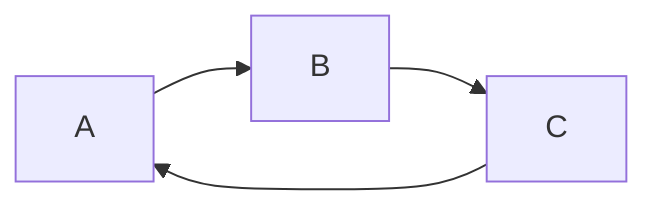
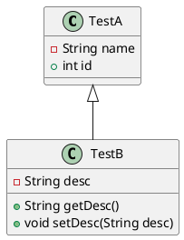

# PlantUML Tour

## 安装PlantUML

```
brew install graphivz
brew install plantuml
```

## 生成UML图

```
plantuml -tpng uml/class.uml
```

## 使用脚本

```
./uml.sh uml/xxxx.uml
```

$f(x) = sin(x) +12$




